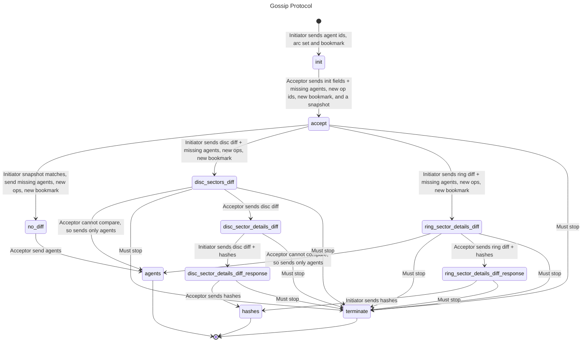

# Kitsune2 Gossip

The gossip protocol for the Kitsune2 project.

## The gossip message flows are described in the following diagram:

## License

Copyright (C) 2024 - 2025, Holochain Foundation

This program is free software: you can redistribute it and/or modify it under the terms of the license
provided in the LICENSE file (Apache 2.0).  This program is distributed in the hope that it will be useful,
but WITHOUT ANY WARRANTY; without even the implied warranty of MERCHANTABILITY or FITNESS FOR A PARTICULAR
PURPOSE.
