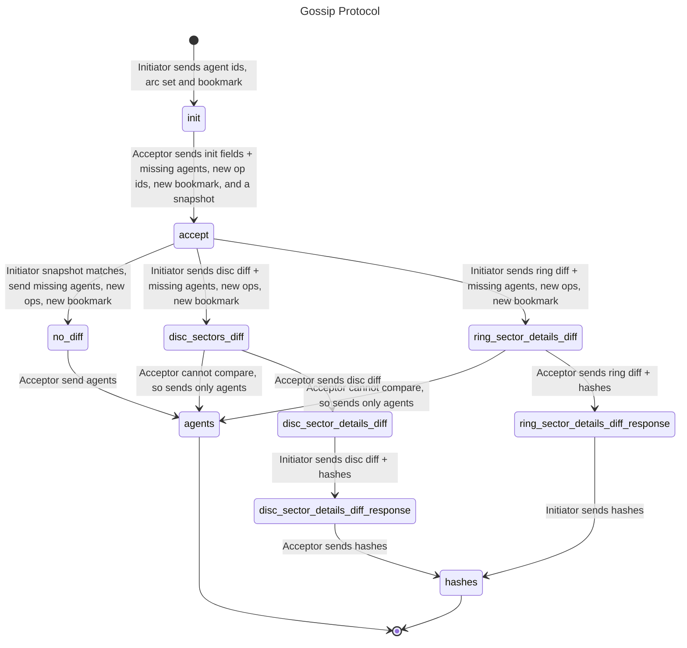

```mermaid
---
title: Gossip Protocol
---
stateDiagram-v2
    [*] --> init: Initiator sends agent ids, arc set and bookmark
    init --> accept: Acceptor sends init fields + missing agents, new op ids, new bookmark, and a snapshot
    
    accept --> no_diff: Initiator snapshot matches, send missing agents, new ops, new bookmark
    accept --> disc_sectors_diff: Initiator sends disc diff + missing agents, new ops, new bookmark
    accept --> ring_sector_details_diff: Initiator sends ring diff + missing agents, new ops, new bookmark
    
    no_diff --> agents: Acceptor send agents
    disc_sectors_diff --> agents: Acceptor cannot compare, so sends only agents
    ring_sector_details_diff --> agents: Acceptor cannot compare, so sends only agents 
    
    disc_sectors_diff --> disc_sector_details_diff: Acceptor sends disc diff
    disc_sector_details_diff --> disc_sector_details_diff_response: Initiator sends disc diff + hashes
    disc_sector_details_diff_response --> hashes: Acceptor sends hashes
    
    ring_sector_details_diff --> ring_sector_details_diff_response: Acceptor sends ring diff + hashes
    ring_sector_details_diff_response --> hashes: Initiator sends hashes
    
    hashes --> [*]
    agents --> [*]
```
